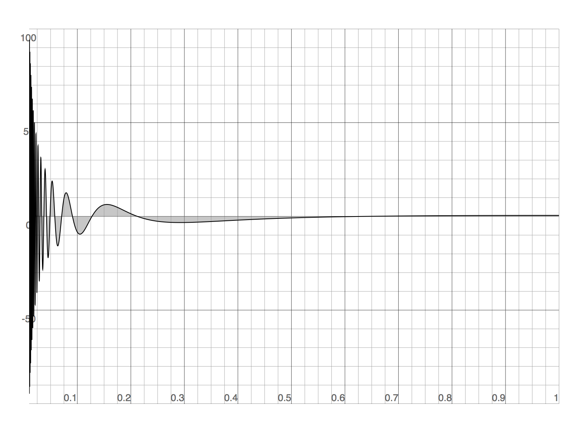
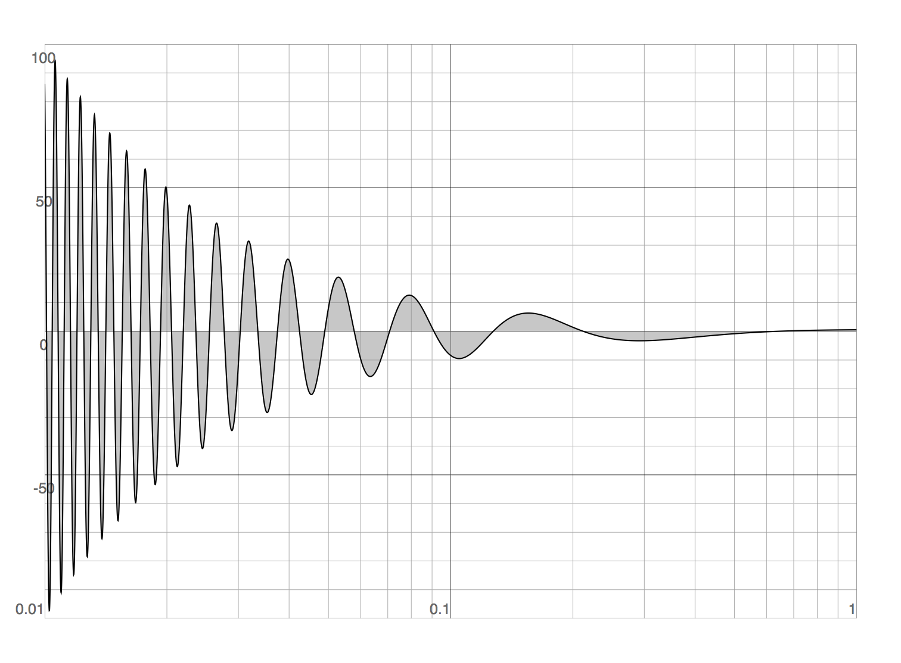

# integrate-adaptive-simpson [](https://travis-ci.org/scijs/integrate-adaptive-simpson) [](http://badge.fury.io/js/integrate-adaptive-simpson) [](https://david-dm.org/scijs/integrate-adaptive-simpson)

> Compute a definite integral of one variable using [Simpson's Rule](https://en.wikipedia.org/wiki/Simpson%27s_rule) with adaptive quadrature


## Introduction

This module computes the definite integral <p align="center"></p> using [Romberg Integration](https://en.wikipedia.org/wiki/Romberg%27s_method) based on [Simpson's Rule](https://en.wikipedia.org/wiki/Simpson%27s_rule). That is, it uses [Richardson Extrapolation](https://en.wikipedia.org/wiki/Richardson_extrapolation) to estimate the error and recursively subdivide intervals until the error tolerance is met. The code is adapted from the pseudocode in [Romberg Integration and Adaptive Quadrature](http://www.math.utk.edu/~ccollins/refs/Handouts/rich.pdf).

## Install

```bash
$ npm install integrate-adaptive-simpson
```

## Example

Other quadrature methods may competitive or superior, but compared with something like [regular Simpson's Rule Ingration](https://github.com/scijs/integrate-simpson), this module is reasonably efficient and robust in the presence of difficulties like oscillatory functions. Consider the definite integral <p align="center"></p>

This function oscillates and diverges near the origin:

<p align="center"></div>

On a log-linear scale, this looks like:

<p align="center"></div>

Achieving an absolute error on the order of  with regular Simpson's Rule integration:

```javascript
function f(x) { return Math.cos(1/x)/x }

require('integrate-simpson')( f, 0.01, 1, 29118 )
```
requires (determined by trial and error to match the error of the adaptive method) about 29118 function evaluations. The same integral computed with adaptive integration:

```javascript
require('integrate-adaptive-simpson')( f, 0.01, 1, 3.1e-6 )
```

requires 2077 function evaluations, a savings of 93%!


Computation of a more modest integral like  may still save about a factor of two on function evaluations (17 for adaptive vs. 45 for regular Simpson's Rule to acheive an absolute error of ). See [examples/comparison.js](examples/comparison.js) for a comparison. Of course the benefit is not needing to tell the algorithm in advance that it may be an expensive function to integrate, making it a not-unreasonable black-box integrator.

## API

#### `require('integrate-adaptive-simpson')( f, a, b [, tol, maxdepth]] )`
**Arguments:**
- `f`: The function to be integrated. A function of one variable that returns a value.
- `a`: The lower limit of integration, .
- `b`: The upper limit of integration, .
- `tol`: The relative error required for an interval to be subdivided, based on Richardson extraplation. Default tolerance is `1e-8`. Be careful—the total accumulated error may be significantly less and result in more function evaluations than necessary.
- `maxdepth`: The maximum recursion depth. Default depth is `20`. If reached, computation continues and a warning is output to the console.

**Returns**: The computed value of the definite integral.

## References
Colins, C., [Romberg Integration and Adaptive Quadrature Course Notes](http://www.math.utk.edu/~ccollins/refs/Handouts/rich.pdf).

## License

(c) 2015 Scijs Authors. MIT License.