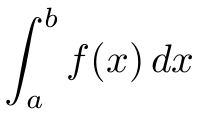
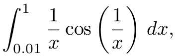
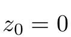
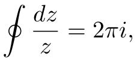
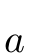

# integrate-adaptive-simpson

[](https://travis-ci.org/scijs/integrate-adaptive-simpson) [](http://badge.fury.io/js/integrate-adaptive-simpson) [](https://david-dm.org/scijs/integrate-adaptive-simpson) [](https://github.com/Flet/semistandard)

> Compute a definite integral of one variable using [Simpson's Rule](https://en.wikipedia.org/wiki/Simpson%27s_rule) with adaptive quadrature

## Introduction

This module computes the definite integral <p align="center"></p> using [Romberg Integration](https://en.wikipedia.org/wiki/Romberg%27s_method) based on [Simpson's Rule](https://en.wikipedia.org/wiki/Simpson%27s_rule). That is, it uses [Richardson Extrapolation](https://en.wikipedia.org/wiki/Richardson_extrapolation) to estimate the error and recursively subdivide intervals until the error tolerance is met. The code is adapted from the pseudocode in [Romberg Integration and Adaptive Quadrature](http://www.math.utk.edu/~ccollins/refs/Handouts/rich.pdf).

## Install

```bash
$ npm install integrate-adaptive-simpson
```

## Example

To compute the definite integral <p align="center"></p> execute:

```javascript
var integrate = require('integrate-adaptive-simpson');

function f (x) {
  return Math.cos(1 / x) / x);
}

intiegrate(f, 0.01, 1, 1e-8);
// => -0.3425527480294604
```

To integrate a vector function, you may import the vectorized version. To compute a contour integral of, say,  about , that is, <p align="center"></p>

```javascript
var integrate = require('integrate-adaptive-simpson/vector');

integrate(function (f, theta) {
  // z = unit circle:
  var c = Math.cos(theta);
  var s = Math.sin(theta);

  // dz:
  var dzr = -s;
  var dzi = c;

  // 1 / z at this point on the unit circle:
  var fr = c / (c * c + s * s);
  var fi = -s / (c * c + s * s);

  // Multiply f(z) * dz:
  f[0] = fr * dzr - fi * dzi;
  f[1] = fr * dzi + fi * dzr;
}, 0, Math.PI * 2);

// => [ 0, 6.283185307179586 ]
```

## API

#### `require('integrate-adaptive-simpson')( f, a, b [, tol, maxdepth]] )`

Compute the definite integral of scalar function f from a to b.

**Arguments:**
- `f`: The function to be integrated. A function of one variable that returns a value.
- `a`: The lower limit of integration, .
- `b`: The upper limit of integration, .
- `tol`: The relative error required for an interval to be subdivided, based on Richardson extraplation. Default tolerance is `1e-8`. Be careful—the total accumulated error may be significantly less and result in more function evaluations than necessary.
- `maxdepth`: The maximum recursion depth. Default depth is `20`. If reached, computation continues and a warning is output to the console.

**Returns**: The computed value of the definite integral.

#### `require('integrate-adaptive-simpson/vector')( f, a, b [, tol, maxdepth]] )`

Compute the definite integral of vector function f from a to b.

**Arguments:**
- `f`: The function to be integrated. The first argument is an array of length `n` into which the output must be written. The second argument is the scalar value of the independent variable.
- `a`: The lower limit of integration, .
- `b`: The upper limit of integration, .
- `tol`: The relative error required for an interval to be subdivided, based on Richardson extraplation. Default tolerance is `1e-8`.
- `maxdepth`: The maximum recursion depth. Default depth is `20`. If reached, computation continues and a warning is output to the console.

**Returns**: An `Array` representing The computed value of the definite integral.

## References
Colins, C., [Romberg Integration and Adaptive Quadrature Course Notes](http://www.math.utk.edu/~ccollins/refs/Handouts/rich.pdf).

## License

(c) 2015 Scijs Authors. MIT License.